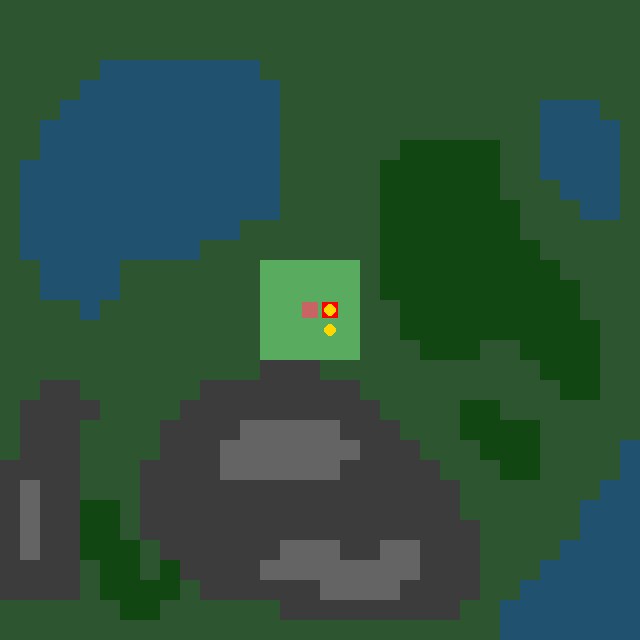

# Hide-And-Seek Engine (SAR Extension)



High-performance OpenMP + pybind11 grid-world simulator for heterogeneous Search and Rescue (SAR), with:

  - CTDE-ready tensors (`C x H x W`) for CNN extractors
  - Hybrid action space (`move` + `radio`)
  - PettingZoo parallel API adapter
  - Local/POV rendering utilities

## Install

```bash
pip install -e .
```

Optional rendering/input dependencies:

```bash
pip install pygame pillow pettingzoo imageio
```

## Level File Formats

### `test_level/tiles.json`

Either list or name-\>object map.
Each tile supports:

  - `rgb`: `[r, g, b]`
  - `altitude`: float
  - `supports_walking`: bool
  - `supports_flying`: bool
  - `supports_aquatic`: bool
  - `blocking`: bool

Movement semantics:

  - Agent can enter tile when it matches **at least one** supported transport mode.
  - If transport does not match:
      - `blocking=true`: tile behaves like wall (entry denied, agent not stuck)
      - `blocking=false`: agent can enter but becomes stuck

### `test_level/agents.json`

Either list or name-\>object map.
Each agent supports:

  - `flying`, `aqueous`, `walking`
  - `altitude_min`, `altitude_max`
  - `base_speed`, `base_view`, `battery`, `deployment_delay`
  - `rgb`
  - `terrain_speed` dictionary by tile name
  - `start` (`[y, x]`, supports normalized `[0..1]` or map coords)

### `test_level/survivors.json`

Either list or name-\>object map.
Each survivor supports:

  - `allowed_savers`: list of agent names
  - `moves`: bool
  - `rgb` (optional)
  - `start` (optional)

### `test_level/level.png`

PNG map where every pixel is matched to nearest tile `rgb` in `tiles.json`.

## Core Environment Usage

```python
from hide_and_seek_engine.env_wrapper import SARBatchedGridEnv

env = SARBatchedGridEnv(
    num_envs=8,
    map_png="test_level/level.png",
    tiles_json="test_level/tiles.json",
    agents_json="test_level/agents.json",
    survivors_json="test_level/survivors.json",
    map_size=32,
    seed=42,
)

obs, info = env.reset()
actions = env.action_space.sample()
obs, rewards, terminated, truncated, info = env.step(actions)
state = env.state()  # global CTDE state
```

### Observation Space (Local Actor Input)

`obs` is a dictionary:

  - `obs["spatial"]`: shape `[Env, Agent, C_local, H, W]`
      - channels include terrain+altitude, local survivor layer, local obs mask, local agent layers
  - `obs["internal"]`: shape `[Env, Agent, 6]`
      - `[deploy_remaining, stuck, view_range, battery, y, x]`

### State Space (Central Critic Input)

`env.state()` returns:

  - `state["spatial"]`: shape `[Env, C_global, H, W]`
  - `state["internal"]`: flattened agent+survivor internal vectors

### Action Space (Hybrid)

Per agent action:

  - movement: 2D vector in `[-1, 1]`
  - radio: discrete channel `0..3`
      - `0` = no transmit
      - `1,2,3` = transmit channel (merged into shared local knowledge)

Tensor shape for stepping batched env:

  - `[num_envs, 4, 3]` (`dy`, `dx`, `radio_channel`)

## Rendering

  - Global view: `env.render(env_idx=0)`
      - undiscovered tiles are drawn at half RGB brightness
      - saved survivors are white
  - Agent POV: `env.render_pov(agent_idx=0, env_idx=0)`
      - allies and survivors shown using last-known positions
      - knowledge updates when locally seen or shared by radio

Print radio events from current frame:

```python
env.radio_render()
```

## PettingZoo Parallel API

```python
from hide_and_seek_engine.env_wrapper import SARParallelPettingZooEnv

pz_env = SARParallelPettingZooEnv(
    map_png="test_level/level.png",
    tiles_json="test_level/tiles.json",
    agents_json="test_level/agents.json",
    survivors_json="test_level/survivors.json",
)

obs, infos = pz_env.reset()
actions = {
    agent: {"move": [0.0, 1.0], "radio": 1}
    for agent in pz_env.agents
}
obs, rewards, terminations, truncations, infos = pz_env.step(actions)
```

## Test & Benchmark Suite

Run unit checks + 10k-step stress tests + FPS measurements + renderer smoke test:

```bash
python env_spec.py --steps 10000 --envs 1 2 4 8
```

Skip renderer test:

```bash
python env_spec.py --steps 10000 --envs 1 2 4 8 --skip-render
```

## Human Data Recorder

Collect SARSA tuples from one human-controlled random agent each episode:

```bash
python human_runner.py
```

To record a visual replay of the session:

```bash
python human_runner.py --record
```

Controls:

  - movement: `W`, `A`, `S`, `D`
  - radio: `1`, `2`, `3`

After each episode, enter a save name. Data is written to `saved_human_behavior/<name>/`, containing:

  - `.npy` files for all observation/state/action/reward buffers.
  - `replay.gif` (if `--record` was used).
