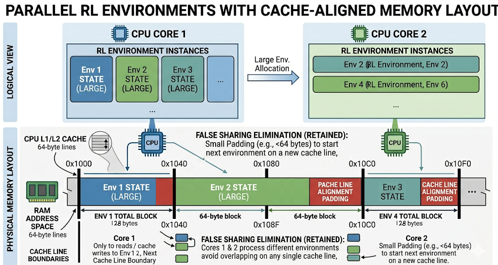
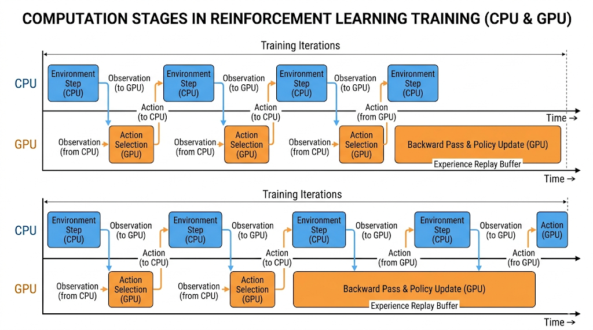

# Building a High-Throughput MARL Environment: From 700 to 4,000,000 FPS

When engineering an environment for Deep Reinforcement Learning (DRL), especially Multi-Agent RL (MARL) with complex spatial and logical states, the simulation itself often becomes the primary bottleneck rather than the neural network backpropagation. 

This tutorial explores the architectural journey of a hide-and-seek grid environment. Through three major revisions, we moved from a standard Python implementation running at 700 Frames Per Second (FPS) to a highly optimized C++ engine exceeding 4,000,000 FPS. 

By the end of this tutorial, you will understand how to apply Data-Oriented Design (DOD) to CPU simulations, how to leverage zero-copy memory transfers between the CPU and GPU, and how these optimizations plug into modern distributed RL architectures.

---

## The Neural Network Interface

Before diving into the C++ engine, it is important to understand what the neural network expects. The environment must feed observations into a multi-branch encoder.
- **The Spatial Network:** A Convolutional Neural Network (CNN) that processes a 3D tensor (Channels $\times$ Height $\times$ Width) representing the map layout, altitudes, observed regions, and entity locations.
- **The Logical Network:** A Multi-Layer Perceptron (MLP) or Transformer that processes a flat 1D vector containing agent statistics like battery life, current $x/y$ coordinates, and deployment status.

For the neural network to learn effectively, these observations must be batched across hundreds or thousands of parallel environments.

**Why Volume Matters (Online RL Context):** 
Online RL algorithms, such as Proximal Policy Optimization (PPO), are notoriously sample-inefficient. Because they only train on "fresh" on-policy data and throw away older trajectories, the engine must replenish the experience buffer rapidly. Furthermore, communicating with a GPU incurs a fixed latency penalty. Moving memory across the PCIe bus and spinning up CUDA kernels takes time, which physically caps a standard GPU training loop to a few hundred iterations per second. Since the *iterations per second* are hardware-locked by this overhead, the only vector left to scale overall throughput is *volume per iteration*. By calculating hundreds of environments simultaneously on the CPU, we can pass massive batches to the GPU, offsetting PPO's sample inefficiency with sheer scale.

### Understanding the Spatial State Space as Stacked Features
The spatial observation is essentially a set of stacked 2D feature grids. Unlike a standard 3-channel RGB image, this state space layers multiple categorical and continuous maps into heavily structured channels based on physical simulation dynamics. According to the architecture established in our engine, a CNN processes:
- **Traversal Kinetics (Categorical):** Channel masks dictate if tiles are Walkable (for surface agents), Aquatic (for marine units), or Flyable (for quadcopters).
- **Collision Models (Categorical):** Boolean grids defining if a space is a blocking wall or open environment, resolving spatial boundaries natively without physical raycasts.
- **Topological Modifiers (Continuous):** Dynamic terrain altitudes that interlock with agent view-ranges to render localized, true-Euclidean line-of-sight occlusion.
- **The Fog-of-War:** Masks tracking dynamically discovered regions or Persons of Interest (POIs).

For instance, channel 0 might act as a one-hot mask for water tiles, channel 1 could contain continuous altitude mapping, channel 2 could represent the globally observed space (who has seen what), and subsequent channels explicitly encode individual agent coordinates. This stacked structure is highly interpretable by multi-branch encoders like those in IMPALA, but constructing it across hundreds of simulated environments demands a massive, sequential memory footprint on the CPU.

### The Python Global Interpreter Lock (GIL) Bottleneck
When attempting to scale simulations to generate these large batches concurrently, engineers often hit a hard ceiling caused by Python's Global Interpreter Lock (GIL). The GIL is a mutex that prevents multiple native threads from executing Python bytecodes simultaneously. As a result, even on a modern 64-core CPU, a pure multithreaded Python simulation loop is fundamentally locked to a single core's performance. Defeating the GIL to unlock true parallel execution is the primary motivation for migrating the environment logic.

---

## The Evolution of the Simulation Engine

### Revision 1: Pure Python and NumPy (700 FPS)
The first iteration of this environment was built entirely in Python using vectorized NumPy operations. 
* **The Bottleneck:** While NumPy is exceptionally fast for bulk matrix math like computing convolutions on an image array, reinforcement learning environments consist of overwhelmingly sequential, non-linear logic branching. For instance, the logic `If Agent A moves to Tile (y, x), verify Tile (y, x) is WALKABLE, then update Agent A's battery - 1, then check Euclidean distance to Person of Interest C to see if they are SAVED` is not bulk matrix math. Python's high-level interpreter abstracts these operations, adding tens of thousands of CPU cycles of abstraction overhead for a single game step.
* **The GIL Impact:** Because of the Python interpreter, environments cannot actually run multithreaded. Spawning 32 threads merely forced Python to rapidly switch the Global Interpreter Lock between threads on a single core, providing no net gain. The simulation remained profoundly CPU-bound at 700 FPS.

### Revision 2: Naive C++ and Direct Tensor Manipulation (4,000 FPS)
To escape Python's GIL and natively parallelize the logic, the environment was translated into C++ using **OpenMP**. OpenMP (Open Multi-Processing) is a standard API that allows developers to easily split a single running program across multiple CPU cores by adding simple compiler directives (like `#pragma omp parallel for`) above their loops. This meant that on a 32-core CPU, we could now calculate 32 environment steps genuinely at the same time. However, this version made a critical architectural mistake: **it operated directly on the PyTorch tensor memory representation.**

The machine learning model requires its spatial input to be formatted as an `(N_Environments, Channels, Height, Width)` continuous floating-point memory block. Since constructing this required computation, the C++ code used this Python-dictated geometry as its internal game state.
* **The Bottleneck:** While it enabled true OpenMP parallel threading, iterating this shape is catastrophic for CPU caches. If the C++ simulation needed to check a tile type, it had to scan vertically down channels spanning huge gaps of memory. Logical `bools` (e.g., "Has the agent seen this tile?") were allocated natively as 32-bit floats initialized as `1.0`. Each float takes 32 bits instead of 1-bit for a boolean, destroying hardware cache locality and causing constant RAM fetch operations. Despite utilizing 32 cores, memory contention effectively hard-capped scaling near 16 environments, resulting in a measly 4,000 FPS.

### Revision 3: Data-Oriented Design and Zero-Copy Tensors (4,000,000+ FPS)
The state-of-the-art iteration completely decoupled the *Simulation State* from the *Neural Network Observation State*. 

1. **Simulation State:** The CPU maintains its own dense, tightly packed Data-Oriented layout. Tiles are simple integers, and boolean states are dynamically packed into 8-bit `uint8_t` variables. Everything is stored in contiguous 1D arrays (`std::vector`).
2. **Observation State:** At the very end of the simulation step, the engine performs a "gather and scatter" operation, writing the dense C++ state into the sparse PyTorch float tensors.

This separation of concerns allows the CPU to compute the simulation logic locally in its L1/L2 caches, resulting in an exponential speedup.

---

## Core Optimization Concepts

If you are building your own high-performance simulators, here are the architectural pillars you must implement.

### 1. Data Locality and Avoiding False Sharing

**Understanding the CPU Cache:**
Modern CPUs compute data orders of magnitude faster than they can fetch it from main memory (RAM). To bridge this gap, CPUs have tiny, ultra-fast memory banks built directly onto the silicon die itself, known as the CPU memory cache (L1, L2, L3 layers). When a CPU requests a single variable like an agent's `x` coordinate from RAM, it doesn't retrieve just those 4 bytes; it inherently assumes you are going to need the data sitting next to it soon. Therefore, it mathematically forces a bulk fetch of an entire contiguous block of adjacent memory called a "cache line". Across almost all modern CPUs, this chunk is rigidly set to exactly 64 contiguous bytes. Once those 64 bytes are pulled into the ultra-fast L1 CPU cache, the processor can read and mutate them instantly without the multi-hundred-cycle penalty of walking all the way back out to RAM.

**What this means for Data-Oriented Design (DOD):**
Because the CPU *must* fetch 64-byte blocks at a time, your data layout defines your speed. If you use standard Object-Oriented Programming (OOP) and create large, bloated class instances carrying unrelated metadata, an agent's object might be 128 bytes wide. Fetching one agent takes two RAM calls, and fetching ten sequential agents takes twenty round-trips. This is known as "cache misses" and stalls the CPU entirely.

In our Revision 3 C++ engine, data is deliberately packed. Bools are compressed into 8-bit `uint8_t` proxies. We bit-pack tile types, walkable flags, and observed masks into a single 32-bit `uint32_t`. Since a single tile is exactly 4 bytes wide, the CPU grabs $64 \div 4 = 16$ contiguous tiles *for free* every single time it fetches a tile sequentially from memory. This natively annihilates RAM latency.

**The "False Sharing" Threading Hazard:**

The 64-byte hardware limit also introduces severe, hidden threading risks when parallelizing loops using OpenMP. When you assign Environment 0 to calculate on Core 0, and Environment 1 to calculate on Core 1, everything seems fine logically. However, if the memory block for Environment 0 sits physically side-by-side with Environment 1 in RAM, their edges can overlap on the exact same 64-byte structural cache line. 

If Core 0 modifies its half of the cache line, the silicon physically signals across the CPU that the entire 64-byte block has been "corrupted," instantly forcing Core 1 to invalidate and dump its L1 cache. When Core 1 re-fetches from RAM to edit its own half, it invalidates Core 0's cache. The cores become locked in an endless, invisible loop of overwriting and re-fetching the same cache line—this is known as "False Sharing" and it destroys multi-core performance metrics.

To solve this, the `EnvironmentArena` precisely calculates the exact byte-width of an environment's state and artificially spaces out the memory arrays. It rigidly pads every environment to lock it onto its own specific 64-byte mathematical boundary (e.g., `stride = (raw_stride + 63) & ~63`). By rigorously segregating memory arrays into non-overlapping 64-byte chunks, Thread 0 and Thread 1 never share physical silicon borders, unlocking pure, lock-free throughput scaling.

### 2. Pinned Memory and Zero-Copy Transfers

In traditional ML workflows, you might create a NumPy array on the CPU and then call `.to(device="cuda")` in PyTorch. This forces the OS to allocate pagable memory, copy it to a staging area, and then send it over the PCIe bus to the GPU. Doing this thousands of times a second will bottleneck your entire pipeline.

**The Solution (Pinned Memory and DMA):**
Instead of returning entirely new arrays to Python every step, the system allocates **Pinned Memory** (page-locked memory) in PyTorch upon startup. Non-pinned (pageable) memory can be moved around by the host Operating System (e.g., swapped to a hard drive). Because the OS might yank standard RAM away at any time, a GPU cannot safely read it. For normal unpinned transfers, the CPU must first pause, copy the data into a temporary "safe" locked buffer, and *then* orchestrate the transfer to the GPU, wasting massive amounts of time on redundant copies and CPU cycles.

Pinned memory, however, tells the OS: "Never move this physical RAM." PyTorch passes these raw, locked memory pointers (e.g., `uintptr_t`) directly into the C++ engine via PyBind11. After computing a step, the C++ environment writes state updates *directly* into those PyTorch tensor addresses. 

Because the memory is securely pinned, the GPU can pull the data across the PCIe bus using **Direct Memory Access (DMA)**. DMA is a specialized hardware capability that allows the GPU to reach directly into the host RAM and grab the tensors completely on its own, with zero CPU involvement and zero secondary copy-buffers. This creates a true, lock-step zero-copy pipeline.

### 3. Amortizing GPU Workloads

A neural network forward pass takes a non-trivial amount of time because Python must signal PyTorch, which then allocates PCIe bus cycles to transfer gradients to and from the GPU's memory. Following this, the GPU takes an inherently static latency hit "spinning up" its CUDA computational kernels.

Even with the most streamlined, parallel C++ infrastructure, this GPU IO latency overhead inevitably throttles deep learning simulation loops. Specifically, no matter how fast your 12-core CPU is, if your Python RL loop requests the GPU to compute an action, it incurs hundreds of microseconds of physical delay each request. The result? A hard ceiling on loop cycling, usually maxing out at a few hundred total iterations (FPS) per second. 

However, GPUs natively feature thousands of Arithmetic Logic Units (ALUs) designed to perform the exact same computation simultaneously on massively parallel blocks of numbers. If an RL loop iteration is intrinsically locked out from speeding up chronologically, the only viable way to achieve high sample collection volume is to make every iteration do $N$ times the work. A small neural network layer evaluating 1 solitary environment state requires almost the same chronological time block as evaluating 1,024 independent environments encoded natively in a contiguous volume tensor. Therefore, scaling via massive parallel environment batch sizes amortizes the rigid CUDA kernel spin-up costs out to near zero per environment. 

Note that for very large networks such as LLMs, the GPU throughput is often already maxed out by a single network, especially if the layers or "shards" are pipelined.

As you can infer from the action pipeline diagram above, the arrows (representing memory transfers) and blocks (representing CUDA runtime compute) each incur a time cost that is roughly constant, provided the CPU has cores to spare and the GPU has available compute warps. Because these fixed latency overheads apply uniformly whether you are evaluating 1 or 1,000 environments, you must make every block structurally as productive as possible via massive batching. 

You might wonder if you could pipeline the two phases (stepping the CPU simulations while the GPU simultaneously calculates the next inferences). While possible, Amdahl's Law dictates that the system's maximum speed is fiercely bound by its slowest component. If your massively optimized C++ environment runs at 1,000,000 FPS, but the GPU can only process 400 network updates per second, the pipeline is entirely GPU-bound. Adding asynchronous pipelining complexity to decouple the steps yields absolutely zero meaningful throughput gain, leaving you with nothing but synchronization headaches.

### 4. Stabilizing Distributed RL (A3C, Ape-X, IMPALA)

In Deep Reinforcement Learning, training a neural network on highly correlated, sequential data from a single chronological trajectory severely destabilizes the learning process. 

**The Problem of Correlated Data:**
Imagine an agent navigating a long, red corridor for 100 consecutive frames before finding a reward in a blue room. If the neural network trains strictly on those 100 chronological frames, it will suffer from "catastrophic forgetting." The network's weights will over-adapt to the feature "red walls" and completely "forget" what it learned about blue rooms, green forests, or water. The gradients become hyper-biased to the immediate short-term history. 
In traditional, single-environment algorithms like DQN, this relies on a workaround known as an **Experience Replay Buffer**. By saving memories and randomly pulling independent, uncorrelated transitions from the past, the network artificially creates *temporal stability* by breaking the sequence.

**The Distributed Multi-Environment Solution:**
However, fast online algorithms (like PPO) do not use replay buffers—they must consume "fresh" on-policy data and immediately discard it to remain mathematically correct. If we just stepped 1,024 parallel environments in perfect chronological sync (all starting at $t=0$ together, all facing the same starting red corridor), the entire massive batch of states sent to the GPU would *still* be highly correlated!

Architectures like **A3C** (Asynchronous Advantage Actor-Critic), **Ape-X**, and **IMPALA** solve the data efficiency problem natively by deliberately breaking temporal boundaries. By gathering trajectories from thousands of environments and applying a randomized "burn-in" starting period, the environments spread out in time. At the exact same split-second forward pass on the GPU, Environment 1 is spawning in, Environment 42 is deep in a forest, and Environment 999 is finishing a rescue. The resulting batched data becomes mathematically Independent and Identically Distributed (I.I.D.). 

Building a C++ step function that relies on stateless, pre-allocated memory arenas allows you to seamlessly integrate with these modern distributed RL frameworks. By generating massive spatial scale instantly, you successfully substitute the need for a historical replay buffer.

---

## Conclusion

Transitioning an environment from Python prototypes to ML-ready C++ engines requires shifting your mindset from Object-Oriented representations to Data-Oriented transformations. 

To make your RL environments exceptionally fast, follow these core takeaways:
1. **Escape the GIL:** Move sequential, branch-heavy simulation logic out of Python and into a parallelized C++ engine (e.g., using OpenMP).
2. **Respect the Cache:** Pack data densely into Arrays of Structures (AoS) or Structs of Arrays (SoA). Use `uint8_t` instead of floats for booleans to natively fit exponentially more data into a single 64-byte cache line. It is important that data which is accessed together in code is located together in RAM. 
3. **Prevent False Sharing:** Manually calculate and pad your multi-threaded environment state block sizes to align strictly onto independent 64-byte memory boundaries, mathematically stopping CPU threads from invalidating each other's L1 caches.
4. **Use Zero-Copy Tensors:** Allocate PyTorch Pinned Memory at startup and write directly to it via PyBind11. This unlocks Direct Memory Access (DMA) to completely bypass the CPU and OS paging constraints during PCIe transfers to the GPU.
5. **Amortize GPU Overheads:** Scale your continuous environment batches into the thousands per forward pass to distribute the static PCIe and CUDA kernel spin-up latencies across massive parallel data volume.
6. **Desynchronize Distributed RL:** Harness large vectorized batches with randomized "burn-in" offsets (like IMPALA or A3C) to gather temporally independent I.I.D. training states at a single step, structurally bypassing the need for biased chronological replay buffers.

By adhering to these rules and respecting the physical constraints of the hardware, you can push simulation speeds into the millions of frames per second, ensuring your GPU is never left waiting for data.
